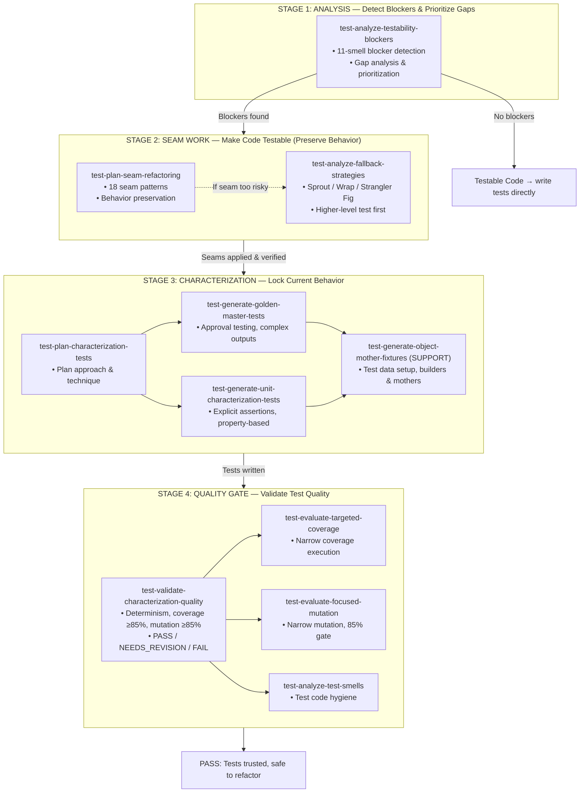

# Legacy Code Testing Workflow

## Overview

This skill suite provides a systematic, stage-based approach to testing legacy code. The workflow progresses through 4 stages, with each stage having clear entry criteria, outputs, and handoffs to the next stage.

## Stage Progression



## Stage Details

### Stage 1: Analysis

**Goal**: Understand what's missing and why

**Entry**: Legacy code without adequate tests

**Skills**:

- `test-analyze-testability-blockers`: 11-smell blocker detection, gap analysis, and prioritization scoring

**Exit Criteria**:

- Gaps are prioritized by business value × change frequency / effort
- Code is classified as either "blocked" or "testable"
- For blocked code: specific smells identified with evidence
- For testable code: proceed directly to test writing

**Handoff**:

- If blockers found → Stage 2 (Seam Work)
- If no blockers → Stage 3 (write tests directly)

---

### Stage 2: Seam Work

**Goal**: Make code testable without changing behavior

**Entry**: Code with identified test blockers

**Skills**:

- `test-plan-seam-refactoring`: 18-pattern seam planning
- `test-analyze-fallback-strategies`: Alternative approaches when seams are too risky

**Exit Criteria**:

- Seams applied and verified (build passes, existing tests still pass)
- Target code can now be instantiated and observed in tests
- Changes are atomic and committed per seam

**Handoff**: Stage 3 (Characterization)

---

### Stage 3: Characterization

**Goal**: Lock current behavior before refactoring

**Entry**: Testable code (seams verified)

**Skills**:

- `test-plan-characterization-tests`: Plan characterization approach
- `test-generate-golden-master-tests`: Approval/snapshot testing for complex outputs
- `test-generate-unit-characterization-tests`: Explicit assertions with property-based/parameterized tests
- `test-generate-object-mother-fixtures`: (Support) Maintainable test data setup

**Exit Criteria**:

- Characterization tests written and passing
- Non-determinism controlled or normalized
- Tests document actual observed behavior (not guessed)
- Test data setup follows Object Mother or Builder pattern

**Handoff**: Stage 4 (Quality Gate)

---

### Stage 4: Quality Gate

**Goal**: Validate test quality before trusting them

**Entry**: Characterization tests written

**Skills**:

- `test-validate-characterization-quality`: Orchestrates all quality checks
- `test-evaluate-targeted-coverage`: Narrow coverage execution with tool readiness
- `test-evaluate-focused-mutation`: Narrow mutation testing with 85% minimum gate
- `test-analyze-test-smells`: Test code hygiene (19-smell catalog)

**Exit Criteria**:

- **PASS**:
  - Mutation score ≥ 85%
  - Surviving mutants triaged
  - Coverage targets met
  - No high-severity test smells
- **NEEDS_REVISION**:
  - Mutation score < 85%, or
  - Untriaged survivors, or
  - High-severity test smells remain
- **FAIL**:
  - Fundamental gaps in coverage or mutation effectiveness

**Handoff**:

- PASS → Safe to refactor
- NEEDS_REVISION → Return to Stage 3 to strengthen tests

---

## Cross-Stage Patterns

### Service Type Independence

All skills apply to **all service types** (domain services, application services, infrastructure services, etc.). Service classification affects the target architecture after the legacy work is complete, but not whether the techniques are valid.

Standard disclaimer used across skills:

> "These {techniques} apply to **all service types**. Service classification affects the target architecture after {stage goal}, but not whether the {core concept} is valid."

### Deterministic Helpers

Skills that require platform-specific execution bundle deterministic helper scripts:

- `test-evaluate-focused-mutation`: mutation readiness, scope planning
- `test-evaluate-targeted-coverage`: coverage readiness, scope planning

Skills that remain manual due to required contextual judgment:

- `test-analyze-testability-blockers`: Blocker detection requires human judgment
- `test-analyze-test-smells`: Smell detection requires distinguishing patterns from actual problems

### References Pattern

All skills with reference materials use consistent formatting:

```markdown
## References (Optional, Manual Read)

Do not treat this section as default runtime knowledge.
Consult only when a task needs {specific use case}.

- [Link title](./path)
```

---

## Common Workflows

### Workflow 1: Simple Legacy Method (No Blockers)

```
test-analyze-testability-blockers
  ↓ (no blockers detected)
test-generate-unit-characterization-tests
  ↓
test-validate-characterization-quality
  ├→ test-evaluate-targeted-coverage
  ├→ test-evaluate-focused-mutation
  └→ test-analyze-test-smells
  ↓
PASS → Safe to refactor
```

### Workflow 2: Blocked Legacy Class (Standard Seam Path)

```
test-analyze-testability-blockers
  ↓ (blockers found)
test-plan-seam-refactoring
  ↓ (seams applied)
test-generate-golden-master-tests
  ↓
test-validate-characterization-quality
  ↓
PASS → Safe to refactor
```

### Workflow 3: High-Risk Legacy Code (Fallback Path)

```
test-analyze-testability-blockers
  ↓ (high-risk blockers)
test-analyze-fallback-strategies
  ↓ (e.g., Wrap Method or Higher-level test first)
test-generate-unit-characterization-tests (or integration)
  ↓
test-validate-characterization-quality
  ↓
PASS → Safe to incrementally introduce lower-level seams
```

---

## Quality Gates Summary

| Stage   | Quality Check                 | Gate                                       |
| ------- | ----------------------------- | ------------------------------------------ |
| Stage 1 | Prioritization                | Business value × change frequency / effort |
| Stage 2 | Behavior preservation         | Build passes, existing tests pass          |
| Stage 3 | Characterization completeness | Determinism controlled, coverage planned   |
| Stage 4 | Test effectiveness            | Mutation ≥ 85%, no high-severity smells    |

---

## Success Metrics

- **Stage 1**: All gaps classified as "blocked", "testable", or "low priority"
- **Stage 2**: Seams applied atomically with verified behavior preservation
- **Stage 3**: Tests document actual behavior with controlled non-determinism
- **Stage 4**: Mutation gate passed, test smells addressed

---

## Related Documentation

- `REVIEW_REPORT.md`: Quality review findings and improvement recommendations
- Individual skill `SKILL.md` files: Detailed skill specifications
